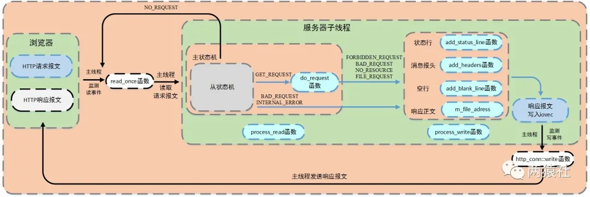

### 五种I/O模型

**阻塞IO:**调用者调用了某个函数，等待这个函数返回，期间什么也不做，不停的去检查这个函数有没有返回，必须等这个函数返回才能进行下一步动作

**非阻塞IO:**非阻塞等待，每隔一段时间就去检测IO事件是否就绪。没有就绪就可以做其他事。非阻塞I/O执行系统调用总是立即返回，不管时间是否已经发生，若时间没有发生，则返回-1，此时可以根据errno区分这两种情况，对于accept，recv和send，事件未发生时，errno通常被设置成eagain

**信号驱动IO:**linux用套接口进行信号驱动IO，安装一个信号处理函数，进程继续运行并不阻塞，当IO时间就绪，进程收到SIGIO信号。然后处理IO事件。

**IO复用:**linux用select/poll函数实现IO复用模型，这两个函数也会使进程阻塞，但是和阻塞IO所不同的是这两个函数可以同时阻塞多个IO操作。而且可以同时对多个读操作、写操作的IO函数进行检测。知道有数据可读或可写时，才真正调用IO操作函数

**异步IO:**linux中，可以调用aio_read函数告诉内核描述字缓冲区指针和缓冲区的大小、文件偏移及通知的方式，然后立即返回，当内核将数据拷贝到缓冲区后，再通知应用程序。

> 注意：阻塞I/O，非阻塞I/O，信号驱动I/O和I/O复用都是同步I/O。同步I/O指内核向应用程序通知的是就绪事件，比如只通知有客户端连接，要求用户代码自行执行I/O操作，异步I/O是指内核向应用程序通知的是完成事件，比如读取客户端的数据后才通知应用程序，由内核完成I/O操作。

### 同步I/O模拟proactor模式

由于异步I/O并不成熟，实际中使用较少，这里将使用同步I/O模拟实现proactor模式。

同步I/O模型的工作流程如下（epoll_wait为例）：

- 主线程往epoll内核事件表注册socket上的读就绪事件。

- 主线程调用epoll_wait等待socket上有数据可读

- 当socket上有数据可读，epoll_wait通知主线程,主线程从socket循环读取数据，直到没有更多数据可读，然后将读取到的数据封装成一个请求对象并插入请求队列。

- 睡眠在请求队列上某个工作线程被唤醒，它获得请求对象并处理客户请求，然后往epoll内核事件表中注册该socket上的写就绪事件

- 主线程调用epoll_wait等待socket可写。

- 当socket上有数据可写，epoll_wait通知主线程。主线程往socket上写入服务器处理客户请求的结果。

### 线程池

- 空间换时间,浪费服务器的硬件资源,换取运行效率.

- 池是一组资源的集合,这组资源在服务器启动之初就被完全创建好并初始化,这称为静态资源.

- 当服务器进入正式运行阶段,开始处理客户请求的时候,如果它需要相关的资源,可以直接从池中获取,无需动态分配.

- 当服务器处理完一个客户连接后,可以把相关的资源放回池中,无需执行系统调用释放资源.

### 静态成员变量

将类成员变量声明为static，则为静态成员变量，与一般的成员变量不同，无论建立多少对象，都只有一个静态成员变量的拷贝，静态成员变量属于一个类，所有对象共享。

静态变量在编译阶段就分配了空间，对象还没创建时就已经分配了空间，放到全局静态区。

- 静态成员变量

    - 最好是类内声明，类外初始化（以免类名访问静态成员访问不到）。

    - 无论公有，私有，静态成员都可以在类外定义，但私有成员仍有访问权限。

    - 非静态成员类外不能初始化。

    - 静态成员数据是共享的。

### 静态成员函数

将类成员函数声明为static，则为静态成员函数。

- 静态成员函数

    - 静态成员函数可以直接访问静态成员变量，不能直接访问普通成员变量，但可以通过参数传递的方式访问。

    - 普通成员函数可以访问普通成员变量，也可以访问静态成员变量。

    - 静态成员函数没有this指针。非静态数据成员为对象单独维护，但静态成员函数为共享函数，无法区分是哪个对象，因此不能直接访问普通变量成员，也没有this指针。

## 线程池分析

线程池的设计模式为半同步/半反应堆，其中反应堆具体为Proactor事件处理模式。

具体的，主线程为异步线程，负责监听文件描述符，接收socket新连接，若当前监听的socket发生了读写事件，然后将任务插入到请求队列。工作线程从请求队列中取出任务，完成读写数据的处理。

### select/poll/epoll

**调用函数**

select和poll都是一个函数，epoll是一组函数

**文件描述符数量**

select通过线性表描述文件描述符集合，文件描述符有上限，一般是1024，但可以修改源码，重新编译内核，不推荐

poll是链表描述，突破了文件描述符上限，最大可以打开文件的数目

epoll通过红黑树描述，最大可以打开文件的数目，可以通过命令ulimit -n number修改，仅对当前终端有效

**将文件描述符从用户传给内核**

select和poll通过将所有文件描述符拷贝到内核态，每次调用都需要拷贝

epoll通过epoll_create建立一棵红黑树，通过epoll_ctl将要监听的文件描述符注册到红黑树上

**内核判断就绪的文件描述符**

select和poll通过遍历文件描述符集合，判断哪个文件描述符上有事件发生

epoll_create时，内核除了帮我们在epoll文件系统里建了个红黑树用于存储以后epoll_ctl传来的fd外，还会再建立一个list链表，用于存储准备就绪的事件，当epoll_wait调用时，仅仅观察这个list链表里有没有数据即可。

epoll是根据每个fd上面的回调函数(中断函数)判断，只有发生了事件的socket才会主动的去调用 callback函数，其他空闲状态socket则不会，若是就绪事件，插入list

**应用程序索引就绪文件描述符**

select/poll只返回发生了事件的文件描述符的个数，若知道是哪个发生了事件，同样需要遍历

epoll返回的发生了事件的个数和结构体数组，结构体包含socket的信息，因此直接处理返回的数组即可

**工作模式**

select和poll都只能工作在相对低效的LT模式下

epoll则可以工作在ET高效模式，并且epoll还支持EPOLLONESHOT事件，该事件能进一步减少可读、可写和异常事件被触发的次数。 

**应用场景**

当所有的fd都是活跃连接，使用epoll，需要建立文件系统，红黑书和链表对于此来说，效率反而不高，不如selece和poll

当监测的fd数目较小，且各个fd都比较活跃，建议使用select或者poll

当监测的fd数目非常大，成千上万，且单位时间只有其中的一部分fd处于就绪状态，这个时候使用epoll能够明显提升性能

### ET、LT、EPOLLONESHOT

**LT水平触发模式**

epoll_wait检测到文件描述符有事件发生，则将其通知给应用程序，应用程序可以不立即处理该事件。

当下一次调用epoll_wait时，epoll_wait还会再次向应用程序报告此事件，直至被处理

**ET边缘触发模式**

epoll_wait检测到文件描述符有事件发生，则将其通知给应用程序，应用程序必须立即处理该事件

必须要一次性将数据读取完，使用非阻塞I/O，读取到出现eagain

**EPOLLONESHOT**

一个线程读取某个socket上的数据后开始处理数据，在处理过程中该socket上又有新数据可读，此时另一个线程被唤醒读取，此时出现两个线程处理同一个socket

我们期望的是一个socket连接在任一时刻都只被一个线程处理，通过epoll_ctl对该文件描述符注册epolloneshot事件，一个线程处理socket时，其他线程将无法处理，当该线程处理完后，需要通过epoll_ctl重置epolloneshot事件

### HTTP报文格式

HTTP报文分为请求报文和响应报文两种，每种报文必须按照特有格式生成，才能被浏览器端识别。

其中，浏览器端向服务器发送的为请求报文，服务器处理后返回给浏览器端的为响应报文。

### 请求报文

HTTP请求报文由请求行（request line）、请求头部（header）、空行和请求数据四个部分组成。

其中，请求分为两种，GET和POST，具体的：

**GET**

```
GET /562f25980001b1b106000338.jpg HTTP/1.1  
Host:img.mukewang.com  
User-Agent:Mozilla/5.0 (Windows NT 10.0; WOW64)  
AppleWebKit/537.36 (KHTML, like Gecko) Chrome/51.0.2704.106 Safari/537.36  
Accept:image/webp,image/*,*/*;q=0.8  
Referer:http://www.imooc.com/  
Accept-Encoding:gzip, deflate, sdch  
Accept-Language:zh-CN,zh;q=0.8  
空行  
请求数据为空
```

**POST**

```
POST / HTTP1.1
Host:www.wrox.com  
User-Agent:Mozilla/4.0 (compatible; MSIE 6.0; Windows NT 5.1; SV1; .NET CLR 2.0.50727; .NET CLR 3.0.04506.648; .NET CLR 3.5.21022)  
Content-Type:application/x-www-form-urlencoded  
Content-Length:40  
Connection: Keep-Alive  
空行  
name=Professional%20Ajax&publisher=Wiley  
```


请求行，用来说明请求类型,要访问的资源以及所使用的HTTP版本。
GET说明请求类型为GET，/562f25980001b1b106000338.jpg(URL)为要访问的资源，该行的最后一部分说明使用的是HTTP1.1版本。

请求头部，紧接着请求行（即第一行）之后的部分，用来说明服务器要使用的附加信息。

- HOST，给出请求资源所在服务器的域名。

- User-Agent，HTTP客户端程序的信息，该信息由你发出请求使用的浏览器来定义,并且在每个请求中自动发送等。

- Accept，说明用户代理可处理的媒体类型。

- Accept-Encoding，说明用户代理支持的内容编码。

- Accept-Language，说明用户代理能够处理的自然语言集。

- Content-Type，说明实现主体的媒体类型。

- Content-Length，说明实现主体的大小。

- Connection，连接管理，可以是Keep-Alive或close。

空行，请求头部后面的空行是必须的即使第四部分的请求数据为空，也必须有空行。

请求数据也叫主体，可以添加任意的其他数据。

### 响应报文

```
HTTP/1.1 200 OK  
Date: Fri, 22 May 2009 06:07:21 GMT  
Content-Type: text/html; charset=UTF-8  
空行  
<html>  
      <head></head>  
      <body>  
            <!--body goes here-->  
      </body>  
</html>  
```

状态行，由HTTP协议版本号， 状态码， 状态消息 三部分组成。
第一行为状态行，（HTTP/1.1）表明HTTP版本为1.1版本，状态码为200，状态消息为OK。

消息报头，用来说明客户端要使用的一些附加信息。
第二行和第三行为消息报头，Date:生成响应的日期和时间；Content-Type:指定了MIME类型的HTML(text/html),编码类型是UTF-8。

空行，消息报头后面的空行是必须的。

响应正文，服务器返回给客户端的文本信息。空行后面的html部分为响应正文。

### http报文处理流程

浏览器端发出http连接请求，主线程创建http对象接收请求并将所有数据读入对应buffer，将该对象插入任务队列，工作线程从任务队列中取出一个任务进行处理。

工作线程取出任务后，调用process_read函数，通过主、从状态机对请求报文进行解析。

解析完之后，跳转do_request函数生成响应报文，通过process_write写入buffer，返回给浏览器端。

### 描述主、从状态机调用关系与状态转移过程的流程图


### 服务器端响应请求报文的逻辑流程图



### 信号处理机制


### 日志系统整体运行流程

